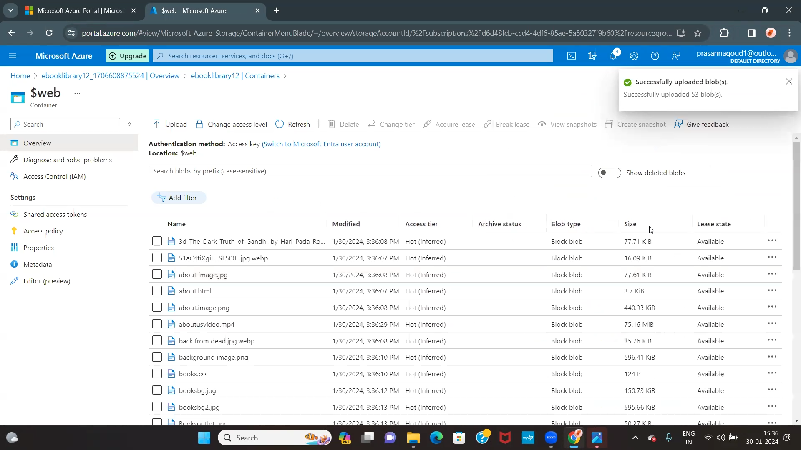

<h1>E-BOOK LIBRARY WEBSITE</h1>
Explore a vast digital realm  of knowledge with our E-Book library website.
<h1>Project Details:</h1>
1.	Project Demo URL       : https://ebooklibrary12.z13.web.core.windows.net/ 
2.	Demo Video URL         : https://youtu.be/ybSfaQe4c0s?si=cZelj_GTlacP6gAY  
3.	GitHub Repository URL  : https://github.com/prasannagoud1916/E-Book-library 
4.	Industry               : ED-TECH(E-Book library) 

<h1>Roles & Responsibilities:</h1>
1)Y.Prasanna(project Development & Deployment )       : Manages the web development project and Deployment process. 
2) I. Sai Teja (content&AI services )                 : Responsible for managing the website content & AI services. 
3) Himabindu (Description&Documentation)              : Responsible for managing the description & Documentaion. 

 <h1>Azure services used:</h1>
1.	Azure blob storage 
2.	Storage account 
3.	Azure Backup service 
4.	Azure AI services  

<h1>Problem Statement:</h1>
In today's digital age, there is a growing need for efficient and user-friendly platforms that facilitate access to a vast array of educational resources. The traditional library model is evolving, and there is a demand for a comprehensive E-Library website that addresses the following challenges:

<h1>Project Description:</h1>
"Discover a digital haven for bibliophiles at our E-book Library website. Immerse yourself in a virtual realm where the written word comes to life, offering a vast and dynamic collection of E-books spanning genres, cultures, and eras. Our user-friendly platform provides seamless navigation, allowing you to browse, search, and explore an extensive catalog with ease. Tailored for modern readers, our website offers a personalized reading experience, complete with customizable preferences and user-friendly features.

<h1>Core Azure Services:</h1>
<b>Azure Blob Storage:-</b> Azure Blob Storage is Microsoft's scalable object storage solution in the Azure cloud. It enables secure and cost-effective storage of unstructured data, such as documents and images. Offering seamless integration with applications, it supports data of any size and optimizes accessibility through a globally distributed network.  
Screenshots---- 

<b>Azure Storage Account:-</b> Azure Storage Account is a foundational component in Microsoft Azure, providing secure and scalable cloud storage. It supports various storage services like Blob, File, Queue, and Table, accommodating diverse data types. With features such as redundancy options and access controls, it ensures reliable and efficient data management. 
Screenshots---- 

 <b>Azure Backup Service:-</b> Azure Backup Service by Microsoft safeguards critical data in the Azure cloud. It offers automated and scalable backup solutions for virtual machines, applications, and files. With features like long-term retention and geo-redundancy, it ensures data resilience and facilitates efficient disaster recovery, enhancing overall data protection strategies.
Screenshots---- 

<h1>Azure AI Service</h1>
<b>Azure Chatbot :-</b> The Azure AI Language Chatbot is a cutting-edge conversational agent powered by Microsoft's Azure platform. Leveraging advanced natural language processing capabilities, it facilitates dynamic and context-aware interactions. This intelligent chatbot employs machine learning algorithms to comprehend user queries, providing personalized responses and assistance across diverse domains. Seamlessly integrating with Azure services, it ensures scalability and reliability. 
<h1>Screenshots:-</h1>
<h2>Chatbot Creation</h2>

.
<h2>chatbot Test</h2>

<h1>Description:-</h1>
Here I am attaching the final working website's screenshot for the reference.
<h1>Working Live Project Display:</h1>

 
<h2>Resource visualizer</h2>

<h1>Final Project Statement:</h1>
This digital haven brings literature to your fingertips, offering a diverse collection of e-books for your reading pleasure. Explore seamlessly organized genres, discover new authors, and enjoy the convenience of digital reading across various devices. With a user-friendly interface, personalized features, and offline accessibility, our E-book library aims to enhance your reading experience. Whether you're a student, a casual reader, or a literary enthusiast, we invite you to embark on a journey through our virtual bookshelves.
